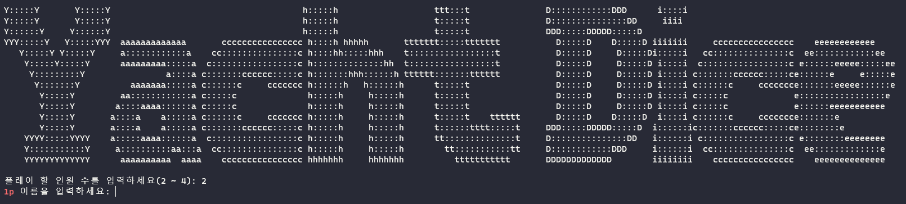
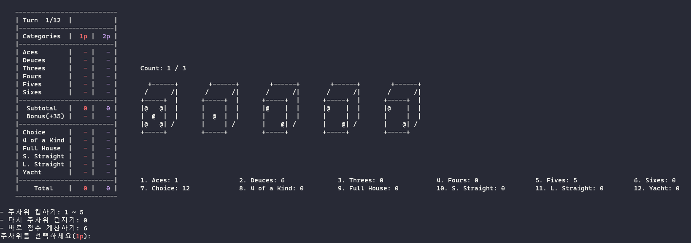
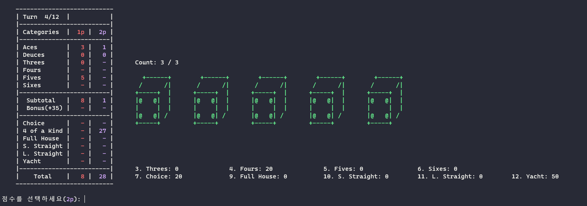

# Yacht Dice

코딩을 하다가 머리를 식히고 싶을 때, 바로 한 판 할 수 있도록 만든 코드

## 실행 방법

레포지토리를 클론해서 main파일을 실행하면 된다.

```
git clone https://github.com/Kdelphinus/Yacht_Dice.git
cd Yacht_Dice
python3 main.py
```

## 게임 방법



파일을 실행한 후, 인원 수와 각 사람의 이름을 입력하면 게임이 시작된다.



1p부터 차례대로 이어지며 세 가지 동작 중 하나를 선택하면 된다.

- 1 ~ 5: 다섯 가지 주사위 중, keep 할 주사위를 고르거나 해제한다.
  - 왼쪽 주사위부터 1, 2, 3, 4, 5
  - 초록색 주사위는 keep 된 것이다.
- 0: keep 하지 않은 주사위들을 다시 던진다.
- 6: 더 이상 던지지 않고 점수를 선택한다.



6을 누르거나 3번의 기회를 모두 사용하면 점수 선택 화면으로 넘어간다. 선택 가능한 점수 번호 중 하나를 선택하면 된다.
